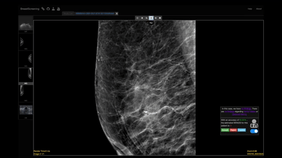

<meta http-equiv="refresh" content="0; url='https://mimbcd-ui.github.io/sa-uta11-results/web/index.html'" />

# UTA11: Statistical Analysis Results


[](https://github.com/MIMBCD-UI/sa-uta11-results/blob/master/LICENSE.md)
[](https://github.com/MIMBCD-UI/sa-uta11-results/commits/master)
[](#backers)
[](#sponsors)
[](https://gitter.im/opprTeam)
[](https://twitter.com/opprGroup)

In this repository, we explore how human-AI interactions are affected by the ability of an AI agent to not only incorporate granular patient information from the AI outputs (*e.g.*, [`dataset-uta7-annotations`](https://github.com/MIMBCD-UI/dataset-uta7-annotations), [`dataset-uta11-rates`](https://github.com/MIMBCD-UI/dataset-uta11-rates), or [`dataset-uta11-findings`](https://github.com/MIMBCD-UI/dataset-uta11-findings) repositories) but also exploring how to adapt the communication tone (*i.e.*, more assertive or suggestive) depending on the medical experience (*i.e.*, novice or expert) of the clinician. Specifically, we compare the AI outputs that explain to clinicians some clinical arguments (*e.g.*, [`dataset-uta7-co-variables`](https://github.com/MIMBCD-UI/dataset-uta7-co-variables), or [`dataset-uta11-findings`](https://github.com/MIMBCD-UI/dataset-uta11-findings) repositories) with more granular information about the patient regarding the lesion details, to a conventional agent (*i.e.*, [`prototype-breast-screening`](https://github.com/MIMBCD-UI/prototype-breast-screening) repository) that only provides numeric estimates (*e.g.*, [BIRADS](https://radiopaedia.org/articles/breast-imaging-reporting-and-data-system-bi-rads) and [accuracy](https://radiopaedia.org/articles/validation-split-machine-learning?lang=us)) of the classification. The study was conducted using a dataset of medical images (*e.g.*, [`dataset-uta7-dicom`](https://github.com/MIMBCD-UI/dataset-uta7-dicom), or [`dataset-uta11-dicom`](https://github.com/MIMBCD-UI/dataset-uta11-dicom) repositories) and patient information, where the AI agents were trained to classify the images based on various features. The data and source code used in this study are available in this repository, along with a detailed explanation of the methods and results. We hope that this work will contribute to the growing field of human-AI interactions in the medical field, and help to improve the communication between AI systems and clinicians.

We present our results for applying the *BreastScreening-AI* framework in two conditions, where clinicians will interact with **conventional** (*e.g.*, [`prototype-breast-screening`](https://github.com/MIMBCD-UI/prototype-breast-screening) repository) and **assertiveness-based** (*e.g.*, [`prototype-assertive-reactive`](https://github.com/MIMBCD-UI/prototype-assertive-reactive) and [`prototype-non-assertive-reactive`](https://github.com/MIMBCD-UI/prototype-non-assertive-reactive) repositories) intelligent agents. The assistant is acting as a second reader, where we compared both conventional and assertiveness-based agents in the context of assisting trained medical personnel for the task of a breast cancer diagnosis. To organize our user evaluations, we devide each study in a group of User Tests and Analysis (UTA) to guide us during these studies. For this repository, used data from the 7th (UTA7) guide and the 11th (UTA11) guide. As follows, some details are provided for more information about these guides.

On the next animation, we present a demo of the prototypes:



Our results are the joint data of the two UTA7 ([10.13140/RG.2.2.16566.14403/1](http://dx.doi.org/10.13140/RG.2.2.16566.14403/1)) and UTA11 ([10.13140/RG.2.2.22989.92645/1](http://dx.doi.org/10.13140/RG.2.2.22989.92645/1)) guides. During this [UTA11](https://github.com/MIMBCD-UI/meta/wiki/User-Research#user-test-evaluations-) study, we used several repositories to store the source code of our prototypes, later tested as *proof-of-concepts* under this research work. The prototypes are available in the [`prototype-assertive-proactive`](https://github.com/MIMBCD-UI/prototype-assertive-proactive), [`prototype-assertive-reactive`](https://github.com/MIMBCD-UI/prototype-assertive-reactive), [`prototype-non-assertive-proactive`](https://github.com/MIMBCD-UI/prototype-non-assertive-proactive), and [`prototype-non-assertive-reactive`](https://github.com/MIMBCD-UI/prototype-non-assertive-reactive) repositories. Each prototype was [deployed](https://github.com/MIMBCD-UI/meta/wiki/Technical#deployment) on a remote server for testing purposes.

These *results* are representing the pieces of information of both [BreastScreening](https://BreastScreening.github.io) and [MIDA](https://mida-project.github.io) projects. These projects are research projects that deal with the use of a recently proposed technique in literature: [Deep Convolutional Neural Networks (CNNs)](https://en.wikipedia.org/wiki/Convolutional_neural_network). From a developed User Interface (UI) and *framework*, these deep networks will incorporate [several datasets](https://github.com/MIMBCD-UI/meta/wiki/Datasets) in different modes. You can find the [deployed prototypes](https://github.com/MIMBCD-UI/meta-private/blob/master/wiki/Technical.md#deployment-prototypes) on the [`Technical.md`](https://github.com/MIMBCD-UI/meta-private/blob/master/wiki/Technical.md#deployment-prototypes) file of the [`meta-private`](https://github.com/MIMBCD-UI/meta-private) repository. More information about the study is also available on the [`User-Research.md`](https://github.com/MIMBCD-UI/meta-private/blob/master/wiki/User-Research.md#test-11-assertive-and-non-assertive-introduction-) file of this [`meta-private`](https://github.com/MIMBCD-UI/meta-private) repository. Unfortunately, you need to be a member of our team to access the restricted information. We also have several [channels](https://github.com/MIMBCD-UI/meta/wiki/Channels) and demos to see in our [YouTube Channel](https://www.youtube.com/channel/UCPz4aTIVHekHXTxHTUOLmXw), please follow us!

## Citing

We kindly ask **scientific works and studies** that make use of the repository to cite it in their associated publications. Similarly, we ask **open-source** and **closed-source** works that make use of the repository to warn us about this use.

You can cite our work using the following BibTeX entry:

```
@inproceedings{10.1145/3544548.3580682,
author = {Calisto, Francisco Maria and Fernandes, Jo\~{a}o and Morais, Margarida and Santiago, Carlos and Abrantes, Jo\~{a}o Maria and Nunes, Nuno and Nascimento, Jacinto C.},
title = {Assertiveness-Based Agent Communication for a Personalized Medicine on Medical Imaging Diagnosis},
year = {2023},
isbn = {9781450394215},
publisher = {Association for Computing Machinery},
address = {New York, NY, USA},
url = {https://doi.org/10.1145/3544548.3580682},
doi = {10.1145/3544548.3580682},
abstract = {Intelligent agents are showing increasing promise for clinical decision-making in a variety of healthcare settings. While a substantial body of work has contributed to the best strategies to convey these agents’ decisions to clinicians, few have considered the impact of personalizing and customizing these communications on the clinicians’ performance and receptiveness. This raises the question of how intelligent agents should adapt their tone in accordance with their target audience. We designed two approaches to communicate the decisions of an intelligent agent for breast cancer diagnosis with different tones: a suggestive (non-assertive) tone and an imposing (assertive) one. We used an intelligent agent to inform about: (1) number of detected findings; (2) cancer severity on each breast and per medical imaging modality; (3) visual scale representing severity estimates; (4) the sensitivity and specificity of the agent; and (5) clinical arguments of the patient, such as pathological co-variables. Our results demonstrate that assertiveness plays an important role in how this communication is perceived and its benefits. We show that personalizing assertiveness according to the professional experience of each clinician can reduce medical errors and increase satisfaction, bringing a novel perspective to the design of adaptive communication between intelligent agents and clinicians.},
booktitle = {Proceedings of the 2023 CHI Conference on Human Factors in Computing Systems},
articleno = {13},
numpages = {20},
keywords = {Clinical Decision Support System, Healthcare, Breast Cancer},
location = {Hamburg, Germany},
series = {CHI '23}
}
```

## Table of contents

* [Prerequisites](#Prerequisites)
* [Usage](#Usage)
* [Roadmap](#Roadmap)
* [Contributing](#Contributing)
* [License & Copyright](#License--Copyright)
* [Team](#Team)
* [Acknowledgements](#Acknowledgements)

## Prerequisites

The following list is showing the required dependencies for this project to run locally:

* [Git](https://git-scm.com/) or any other Git or GitHub version control tool
* [Python](https://www.python.org/) (v3.5 or newer)
* [NodeJS](https://nodejs.org) (v16.14.1 or newer)

Here are some tutorials and documentation, if needed, to feel more comfortable about using and playing around with this repository:

* [Introduction to Node.js](https://nodejs.dev/en/learn)
* [Python Tutorial](https://docs.python.org/3/tutorial/index.html)
* [Git Tutorial](https://git-scm.com/docs/gittutorial)
* [GitHub Quick Tutorial](https://guides.github.com/activities/hello-world/)

## Usage

Usage follow the instructions here to setup the current repository and extract the present data. To understand how the hereby repository is used for, read the following steps.

### Installation

At this point, the only way to install this repository is manual. Eventually, this will be accessible through [`pip`](https://pypi.org/project/pip/) and [`npm`](https://www.npmjs.com/) or any other package managers, as mentioned on the [roadmap](#Roadmap).

Nonetheless, this kind of installation is as simple as cloning this repository. Virtually all Git and GitHub version control tools are capable of doing that. Through the console, we can use the command below, but other ways are also fine.

```bash
git clone https://github.com/MIMBCD-UI/sa-uta11-results.git
```

### Demonstration

Please, feel free to run one of our statistical method. It is a script called `basic_statistics.py` at the `src/methods/` directory. It can be used as follows:

```bash
python src/methods/basic_statistics.py
```

Just keep in mind this are just basic statistics, so it does nothing more than computing basic statistics such as mean and standard deviation for various subsets of data. Also, we did our best to make the basic statistics as user-friendly as possible, so, above everything else, have fun! 😁

## Roadmap

[](https://bestpractices.coreinfrastructure.org/projects/3819)

We need to follow the repository goal, by addressing the thereby information. Therefore, it is of chief importance to scale this solution supported by the repository. The repository solution follows the best practices, achieving the [Core Infrastructure Initiative (CII)](https://bestpractices.coreinfrastructure.org/en/projects/3172) specifications.

Besides that, one of our goals involves creating a configuration file to automatically test and publish our code to `pip` or any other package manager. It will be most likely prepared for the [GitHub Actions](https://github.com/features/actions). Other goals may be written here in the future.

## Contributing

This project exists thanks to all the people who [contribute](CONTRIBUTING.md). We welcome everyone who wants to help us improve this repository. Any question, comment or feedback you have, you can always open a new [Discussion](https://github.com/MIMBCD-UI/sa-uta11-results/discussions) for that topic, or follow what we already have. For instance, we have a [CHI'23 Q&A Discussion](https://github.com/MIMBCD-UI/sa-uta11-results/discussions/8) for the [#CHI2023](https://chi2023.acm.org/) conference. As follows, we present some suggestions.

### Issuer

Either as something that seems missing or any need for support, just open a [new issue](https://github.com/MIMBCD-UI/sa-uta11-results/issues/new). Regardless of being a simple request or a fully-structured feature, we will do our best to understand them and, eventually, solve them.

### Developer

We like to develop, but we also like collaboration. You could ask us to add some features... Or you could want to do it yourself and fork this repository. Maybe even do some side-project of your own. If the latter ones, please let us share some insights about what we currently have.

## Information

The current information will summarize important items of this repository. In this section, we address all fundamental items that were crucial to the current information.

### Related Repositories

- [`dataset-uta7-dicom`](https://github.com/MIMBCD-UI/dataset-uta7-dicom)

- [`dataset-uta7-annotations`](https://github.com/MIMBCD-UI/dataset-uta7-annotations)

- [`dataset-uta7-co-variables`](https://github.com/MIMBCD-UI/dataset-uta7-co-variables)

- [`sa-uta8-utaut`](https://github.com/mida-project/sa-uta8-utaut)

- [`dataset-uta11-dicom`](https://github.com/MIMBCD-UI/dataset-uta11-dicom)

- [`dataset-uta11-findings`](https://github.com/MIMBCD-UI/dataset-uta11-findings)

- [`dataset-uta11-rates`](https://github.com/MIMBCD-UI/dataset-uta11-rates)

- [`prototype-breast-screening`](https://github.com/MIMBCD-UI/prototype-breast-screening)

- [`prototype-assertive-proactive`](https://github.com/MIMBCD-UI/prototype-assertive-proactive)

- [`prototype-assertive-reactive`](https://github.com/MIMBCD-UI/prototype-assertive-reactive)

- [`prototype-non-assertive-proactive`](https://github.com/MIMBCD-UI/prototype-non-assertive-proactive)

- [`prototype-non-assertive-reactive`](https://github.com/MIMBCD-UI/prototype-non-assertive-reactive)

### Dataset Resources

To publish our [datasets](https://www.kaggle.com/MIMBCD-UI) we used a well known platform called [Kaggle](https://www.kaggle.com). To access our project's [Profile Page](https://www.kaggle.com/MIMBCD-UI) just follow the [link](https://www.kaggle.com/MIMBCD-UI). Here, you will find all of our published datasets and any associated information, such as descriptions and download links.

### License & Copyright

Copyright &copy; 2023 [Instituto Superior Técnico](http://tecnico.ulisboa.pt/)

[](http://creativecommons.org/licenses/by-sa/4.0/)

The [`sa-uta11-results`](https://github.com/MIMBCD-UI/sa-uta11-results) repository is distributed under the terms of both [Academic License](ACADEMIC.md) for academic purpose and [Commercial License](COMMERCIAL.md) for commercial purpose, as well as under the [CC-BY-SA-4.0](COPYING.md) copyright. The content of the present repository has obtained the patent right of [World Intellectual Property Organization (WIPO)](https://www.wipo.int) invention. Moreover, the hereby invention for this repository is under protection of the patent number **[WO2022071818A1](https://patents.google.com/patent/WO2022071818A1)** with the application number **PCT/PT2021/050029**. The title of the invention is "*Computational Method and System for Improved Identification of Breast Lesions*", registered under the WO patent office.

See [ACADEMIC](ACADEMIC.md) and [COMMERCIAL](COMMERCIAL.md) for details. For more information about the [MIMBCD-UI](https://mimbcd-ui.github.io/) Project just follow the [link](https://github.com/MIMBCD-UI/meta).

### Team

Our team brings everything together sharing ideas and the same purpose, developing even better work. In this section, we will nominate the full list of important people for this repository, as well as respective links.

#### Authors

* Francisco Maria Calisto [ [Academic Website](https://web.tecnico.ulisboa.pt/francisco.calisto) | [ResearchGate](https://www.researchgate.net/profile/Francisco_Maria_Calisto) | [GitHub](https://github.com/FMCalisto) | [Twitter](https://twitter.com/FMCalisto) | [LinkedIn](https://www.linkedin.com/in/fmcalisto/) ]

* João Fernandes [ [ResearchGate](https://www.researchgate.net/profile/Joao-Fernandes-102) ]

* Margarida Morais [ [ResearchGate](https://www.researchgate.net/profile/Margarida_Morais2) ]

* Carlos Santiago [ [ResearchGate](https://www.researchgate.net/profile/Carlos-Santiago-4) ]

* João Maria Abrantes [ [ResearchGate](https://www.researchgate.net/profile/Joao-Abrantes-2) ]

* Nuno Nunes [ [ResearchGate](https://www.researchgate.net/profile/Nuno_Nunes2) ]

* Jacinto C. Nascimento [ [ResearchGate](https://www.researchgate.net/profile/Jacinto_Nascimento) ]

#### Promoters

* Hugo Lencastre
* Nádia Mourão
* Miguel Bastos
* Pedro Diogo
* João Bernardo
* Madalena Pedreira
* Mauro Machado

#### Companions

* Bruno Dias
* Bruno Oliveira
* Luís Ribeiro Gomes
* Pedro Miraldo

#### Acknowledgements

This work was partially supported by national funds by [FCT](http://fct.pt/) through both UID/EEA/50009/2013 and LARSyS - FCT Project 2022.04485.PTDC (MIA-BREAST) projects hosted by [IST](http://tecnico.ulisboa.pt/), as well as both BL89/2017-IST-ID and PD/BD/150629/2020 grants. We thank [Dr. Clara Aleluia](https://www.researchgate.net/profile/Clara_Aleluia) and her [radiology team](https://repositorio.hff.min-saude.pt/handle/10400.10/4?locale=en) of [HFF](https://hff.min-saude.pt/) for valuable insights and helping using the *assistants* on their daily basis. Further acknowledgments are provided inside the [`ACKNOWLEDGMENTS.md`](ACKNOWLEDGMENTS.md) file of the [`sa-uta11-results`](https://github.com/MIMBCD-UI/sa-uta11-results) repository. Additionally, we are grateful for the invaluable assistance provided by our colleagues of the [HCII](https://hcii.cmu.edu/) @ [CMU](https://cmu.edu/). We are indebted to those who gave their time and expertise to evaluate our work, who among others are giving us crucial information for the [BreastScreening](https://github.com/BreastScreening) project.

### Supporting

Our organization is a non-profit organization. However, we have many needs across our activity. From infrastructure to service needs, we need some time and contribution, as well as help, to support our team and projects.

<span>
  <a href="https://opencollective.com/oppr" target="_blank">
    
  </a>
</span>

#### Contributors

This project exists thanks to all the people who contribute. [[Contribute](CONTRIBUTING.md)].

<span class="image">
  <a href="graphs/contributors">
    
  </a>
</span>

#### Backers

Thank you to all our backers! 🙏 [[Become a backer](https://opencollective.com/oppr#backer)]

<span>
  <a href="https://opencollective.com/oppr#backers" target="_blank">
    
  </a>
</span>

#### Sponsors

Support this project by becoming a sponsor. Your logo will show up here with a link to your website. [[Become a sponsor](https://opencollective.com/oppr#sponsor)]

<span>
  <a href="https://opencollective.com/oppr/sponsor/0/website" target="_blank">
    
  </a>
</span>

<br />

<span>
  <a href="http://www.fct.pt/" title="FCT" target="_blank">
    
  </a>
</span>
<span>
  <a href="https://www.fccn.pt/en/" title="FCCN" target="_blank">
    
  </a>
</span>
<span>
  <a href="https://www.ulisboa.pt/en/" title="ULisboa" target="_blank">
    
  </a>
</span>
<span>
  <a href="http://tecnico.ulisboa.pt/" title="IST" target="_blank">
    
  </a>
</span>
<span>
  <a href="http://hff.min-saude.pt/" title="HFF" target="_blank">
    
  </a>
</span>
<span>
  <a href="https://www.chtmad.min-saude.pt/" title="CHTMAD" target="_blank">
    
  </a>
</span>

##### Departments

<span>
  <a href="http://dei.tecnico.ulisboa.pt" title="DEI" target="_blank">
    
  </a>
</span>
<span>
  <a href="http://deec.tecnico.ulisboa.pt" title="DEEC" target="_blank">
    
  </a>
</span>

##### Laboratories

<span>
  <a href="http://sipg.isr.tecnico.ulisboa.pt/" title="SIPG" target="_blank">
    
  </a>
</span>
<span>
  <a href="http://welcome.isr.tecnico.ulisboa.pt/" title="ISR" target="_blank">
    
  </a>
</span>
<span>
  <a href="http://larsys.pt/" title="LARSys" target="_blank">
    
  </a>
</span>
<span>
  <a href="https://www.m-iti.org/" title="M-ITI" target="_blank">
    
  </a>
</span>
<span>
  <a href="http://www.inesc-id.pt/" title="INESC-ID" target="_blank">
    
  </a>
</span>

##### Domain

<span>
  <a href="https://europa.eu/" title="EU" target="_blank">
    
  </a>
</span>
<span>
  <a href="https://www.portugal.gov.pt/" title="Portugal" target="_blank">
    
  </a>
</span>
